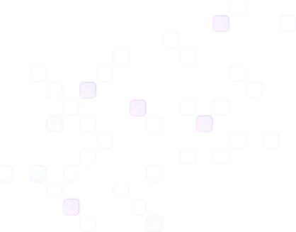

<div align="center">

# 🚀 Shivansh Pandey — Developer Portfolio

[](https://portfolio-project-ivory-omega.vercel.app/)
[](https://react.dev/)
[](https://threejs.org/)
[](https://vitejs.dev/)
[](https://tailwindcss.com/)

A modern, interactive developer portfolio featuring immersive 3D scenes, scroll-driven animations, and a sleek dark UI — built with React, Three.js (R3F), GSAP, and Vite.



</div>

---

## ✨ Features

- **3D Hero Scene** — Interactive room model rendered with React Three Fiber, featuring custom lighting, floating particles, and orbital controls
- **3D Tech Stack Icons** — Floating GLB models for each technology with hover animations
- **3D Contact Scene** — Animated computer model in the contact section
- **Scroll-Driven Animations** — GSAP + ScrollTrigger powers timeline reveals, counter animations, and section entrances
- **Animated Counter** — Number flow counters that trigger on scroll into view
- **Marquee Logo Showcase** — Infinite scroll strip of client/company logos
- **Glow Cards** — Mouse-tracking conic gradient glow effect on testimonial & experience cards
- **EmailJS Contact Form** — Fully functional contact form with loading state
- **Responsive Design** — Mobile-first layout across all sections
- **Glassmorphism Navbar** — Blur + gradient border navbar on scroll

---

## 🛠️ Tech Stack

| Category | Technology |
|---|---|
| **Framework** | React 18 |
| **Build Tool** | Vite 5 |
| **3D Rendering** | React Three Fiber, Three.js, @react-three/drei |
| **Animations** | GSAP, @gsap/react, ScrollTrigger |
| **Styling** | Tailwind CSS v4 |
| **3D Models** | GLTF/GLB (optimized via gltfjsx) |
| **Email** | EmailJS |
| **Number Animation** | @number-flow/react |
| **Responsive** | react-responsive |
| **Deployment** | Vercel |

---

## 📁 Project Structure

```
portfolio-project/
├── public/
│   ├── images/          # UI assets — logos, project screenshots, client avatars
│   ├── models/          # Optimized .glb files for Three.js scenes
│   │   ├── optimized-room.glb
│   │   ├── computer-optimized-transformed.glb
│   │   ├── react_logo-transformed.glb
│   │   ├── python-transformed.glb
│   │   └── ...
│   └── vite.svg
├── src/
│   ├── components/
│   │   ├── models/
│   │   │   ├── contact/         # ContactExperience.jsx, Computer.jsx
│   │   │   ├── hero_models/     # HeroExperience.jsx, HeroLights.jsx, Particles.jsx, Room.jsx
│   │   │   └── tech_logos/      # TechIcon.jsx
│   │   ├── AnimatedCounter.jsx
│   │   ├── Button.jsx
│   │   ├── GlowCard.jsx
│   │   ├── LogoShowcase.jsx
│   │   ├── NavBar.jsx
│   │   └── TitleHeader.jsx
│   ├── constants/
│   │   └── index.js             # All content — nav links, projects, experience, testimonials
│   ├── sections/
│   │   ├── Hero.jsx
│   │   ├── ShowcaseSection.jsx
│   │   ├── FeatureCards.jsx
│   │   ├── ExperienceSection.jsx
│   │   ├── TechStack.jsx
│   │   ├── TestimonialsSection.jsx
│   │   ├── ContactSection.jsx
│   │   └── Footer.jsx
│   ├── App.jsx
│   ├── index.css
│   └── main.jsx
├── .env                          # Environment variables (EmailJS keys)
├── index.html
├── package.json
└── vite.config.js
```

---

## 🚀 Getting Started

### Prerequisites

- **Node.js** v18 or higher
- **npm** or **yarn**

### Installation

```bash
# 1. Clone the repository
git clone https://github.com/your-username/portfolio-project.git
cd portfolio-project

# 2. Install dependencies
npm install

# 3. Set up environment variables
cp .env.example .env
# Fill in your EmailJS credentials (see below)

# 4. Start the development server
npm run dev
```

Open [http://localhost:5173](http://localhost:5173) in your browser.

### Build for Production

```bash
npm run build
npm run preview   # Preview the production build locally
```

---

## 🔐 Environment Variables

Create a `.env` file in the root directory with the following:

```env
VITE_APP_EMAILJS_SERVICE_ID=your_service_id
VITE_APP_EMAILJS_TEMPLATE_ID=your_template_id
VITE_APP_EMAILJS_PUBLIC_KEY=your_public_key
```

> Get these from your [EmailJS dashboard](https://www.emailjs.com/) after setting up a service and email template.

---

## 📦 Key Dependencies

```json
{
  "react": "^18.x",
  "three": "^0.x",
  "@react-three/fiber": "^8.x",
  "@react-three/drei": "^9.x",
  "gsap": "^3.x",
  "@gsap/react": "^2.x",
  "@emailjs/browser": "^4.x",
  "@number-flow/react": "^0.x",
  "react-responsive": "^10.x",
  "tailwindcss": "^4.x"
}
```

---

## 🎨 Customization

All site content is centralized in **`src/constants/index.js`**. To personalize the portfolio:

- **Nav links** → `navLinks` array
- **Hero word slider** → `words` array
- **Stats/counters** → `counterItems` array
- **Projects** → Edit `ShowcaseSection.jsx` directly with your project images & descriptions
- **Work experience** → `expCards` array (title, date, responsibilities, logos)
- **Tech stack** → `techStackIcons` (3D GLB models) and `techStackImgs` (flat images)
- **Testimonials** → `testimonials` array
- **Social links** → `socialImgs` array

---

## 🌐 Deployment

This project is deployed on **Vercel**. To deploy your own:

```bash
# Install Vercel CLI
npm i -g vercel

# Deploy
vercel
```

Or connect your GitHub repo directly on [vercel.com](https://vercel.com) for automatic deployments on every push.

---

## 📄 License

This project is open source and available under the [MIT License](LICENSE).

---

<div align="center">

Built with ❤️ by **Shivansh Pandey**

[](https://portfolio-project-ivory-omega.vercel.app/)
[](https://linkedin.com/in/your-profile)

</div>
